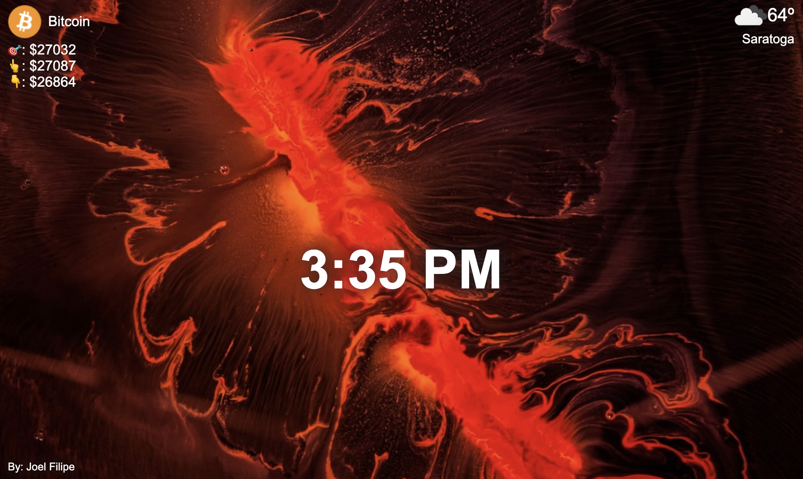

### Personal Dashboard Chrome Extension

- Built using ES6 `async-await` and `fetch` api
- Fetched data from `Unsplash` api for background images
- Uses browsers inbuilt `navigator.geolocation.getCurrentPosition` method to get location data, which is the queries the open weather api to get weather Data
- Uses `Coin Gecko` API to fetch crypto currency data

### Built With 
  